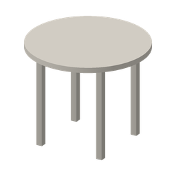

# DiaStage · 22件道具菜单预览

本包将已确认的22件置景模型做成菜单图标，沿用灰、黑、白、米色的低反光哑光风格。模型结构、形状、尺寸和资源ID保持原样。小图直接由原模型网格渲染，GLB文件与上一版哑光模型逐字节相同。

**折叠补充要求：二联、三联景片可以像屏风一样沿连接处折叠，分别有1处、2处可以调节。界面使用“折叠景片”“折叠位置”“打开角度”等普通话。请先阅读 [CODEX_景片折叠接入说明.md](CODEX_景片折叠接入说明.md)，并按manifest中的 `articulation` 接入部件调节；整件旋转与折叠分别保存。当前HTML仍是静态菜单预览。**

## 如何查看

1. 解压整个压缩包，双击 **DiaStage_道具菜单预览.html**，用 Edge、Chrome 或 Firefox 打开。
2. 点击分类，或按名称、编号搜索道具。单击小图，在详情中查看名称和模型尺寸。
3. 点击详情大图可放大，按 `Esc` 关闭。双击卡片或点击“加入置景清单”可选用道具；重复加入会增加数量。
4. 点击清单中的 `−` 移除一个。点击“导出清单”下载 JSON，记录选用道具及数量。

HTML内嵌全部预览图，单独下载这一文件也能离线使用。清单在当前页面内有效；需要保留时请导出。这里完成的是道具菜单与清单预览，舞台中的实际放置由DiaStage主应用接入。

## 文件结构

| 文件/目录 | 用途 |
|---|---|
| `DiaStage_道具菜单预览.html` | 可直接打开的独立菜单示例，含分类、搜索、放大、清单 |
| `DiaStage_22件道具菜单总览.png` | 22件道具同屏总览 |
| `thumbnails/256/*.png` | 22张256×256透明PNG，用于菜单卡片 |
| `thumbnails/512/*.png` | 22张512×512透明PNG，用于高清卡片和详情 |
| `models/*.glb` | 对应22件已确认的哑光模型 |
| `prop-menu-manifest.json` | ID、名称、分类、小图路径、模型路径、米制尺寸及来源 |
| `README_给Codex.md` | 本说明及接入约定 |
| `CODEX_景片折叠接入说明.md` | 二联、三联的铰接节点、角度、坐标转换、交互和验收要求 |

每张小图均不含文字。名称、尺寸、选择标记由UI绘制，方便中文显示、调整布局和替换主题。图片为正交视图，方位角−60°、俯角24°，物件最长投影边约占画框82%；各图分别适配画框，不能以小图大小判断真实尺寸。

## 给Codex的接入任务

将本包接入DiaStage现有置景道具菜单。使用资源清单中的稳定ID连接小图与模型，保留原模型尺寸和灰白米色哑光外观。请先阅读项目的AGENTS.md及已有资源管理、场景状态和撤销实现，再按以下约定完成接入。

1. 将 `thumbnails` 和 `models` 放入项目现有静态资源位置，按实际资源根目录解析manifest中的相对路径。文件路径区分大小写。
2. 根据manifest的6个分类生成菜单。每张卡片显示小图、中文名和 `dimension_label`；原图中缺失而由模型补足的尺寸保留在 `assumed_fields` 中，不改写为原图确认尺寸。
3. 单击卡片只预览。双击卡片或点击选用按钮，向主应用发出一次选用请求；在现有放置流程中创建实例。不要在预览时加载全部22件GLB。
4. 每次放置生成独立实例ID。共享静态网格资源，分离实例变换状态；需要单独修改材质时克隆材质。沿用既有落地、碰撞、对齐与撤销流程。
5. 旋转、移动、吸附以及UE5键位由3D视口的既有控制系统处理；本菜单不新增 `Q/E`、`Ctrl` 或滚轮的全局监听。搜索框输入时仍按主应用规则屏蔽视口快捷键。
6. 保留键盘可达性：原生按钮、可见焦点、分类的 `aria-pressed`、搜索标签、放大对话框的Esc关闭。选中状态不能只靠颜色，应保留勾选标记。

建议桌面菜单卡片宽150–190 CSS像素；一般使用256图，2倍屏使用512图或 `srcset`。边界圆角、背景色、标题和选择边框在CSS中定义。示例使用暖浅灰底和低饱和绿色选择标记，选择色可替换为项目现有主题色。

```html

```

## 示例事件接口

独立HTML会在当前window上触发下列事件，便于接入时核对语义。它不自动操作用户现有工程。若拆分成React组件，优先改成类型明确的 `onPreview` / `onPick` 回调；不要同时注册两条添加通路。

| 事件 | 触发 | detail |
|---|---|---|
| `diastage:prop-preview` | 选中卡片；页面初始化默认预览圆桌 | `{ assetId }` |
| `diastage:prop-pick` | 双击卡片或点击“加入置景清单” | `{ assetId, modelUrl, quantity: 1 }` |

```js
window.addEventListener('diastage:prop-pick', (event) => {
  const { assetId, modelUrl } = event.detail;
  // 在这里连接DiaStage现有的“待放置道具”入口。
  // modelUrl相对于资源清单所在目录；单次事件只提交一次。
});
```

HTML还提供访问接口 `window.DiaStagePropMenu.manifest`、`getSelection()` 和 `selectAsset(assetId)`。导出的清单如下，尚未包含位置、旋转和缩放，不能直接当作完整舞台工程导入。

```json
{
  "schema_version": "1.0",
  "title": "DiaStage 置景清单",
  "items": [
    {
      "assetId": "SCN-TABLE-090",
      "name": "圆桌",
      "quantity": 1,
      "model": "models/SCN-TABLE-090.glb"
    }
  ],
  "placement_status": "unplaced"
}
```

## 分类与对应关系

| 分类 | 物品 |
|---|---|
| 空间围合 · 3 | 单帘景片、二帘组合、三帘组合 |
| 门窗 · 4 | 窗景片、落地窗景片、单门景片、双门景片 |
| 台块与支撑 · 5 | 一号台块、二号台块、三号台块、枕木、方墩 |
| 沙发 · 2 | 长沙发、短沙发 |
| 桌 · 4 | 三屉桌、二屉桌、圆桌、特殊桌 |
| 椅凳 · 4 | 硬椅、软椅、长凳、板凳 |

模型按实际米制1:1导出。glTF为Y向上，原始Blender数据为Z向上；映射记录在manifest的 `coordinate_system` 中，导入已转换的GLB时不要再次重复转换。若项目沿用厘米显示，请只在显示或单位边界换算，避免缩放两次。

来源沿用《景图示意图总集(1).ppt》及上一版22件哑光置景模型；保留原文件“内部资料，请勿外传，注重版权”的来源标注。此包用于既有项目中的预览接入。

## 交付检查

44个PNG均已解码核对尺寸、透明通道和文件对应关系；22个GLB与原哑光模型的字节及SHA-256一致。已通过DOM交互检查，包括分类数量、中文与ID搜索、空结果恢复、22件详情、双击单次加入、数量递减和清单数据；总览逐项查看完成。本环境未运行浏览器端到端验证，接入主应用时请在目标浏览器中检查详情对话框、文件下载和窄屏布局。
