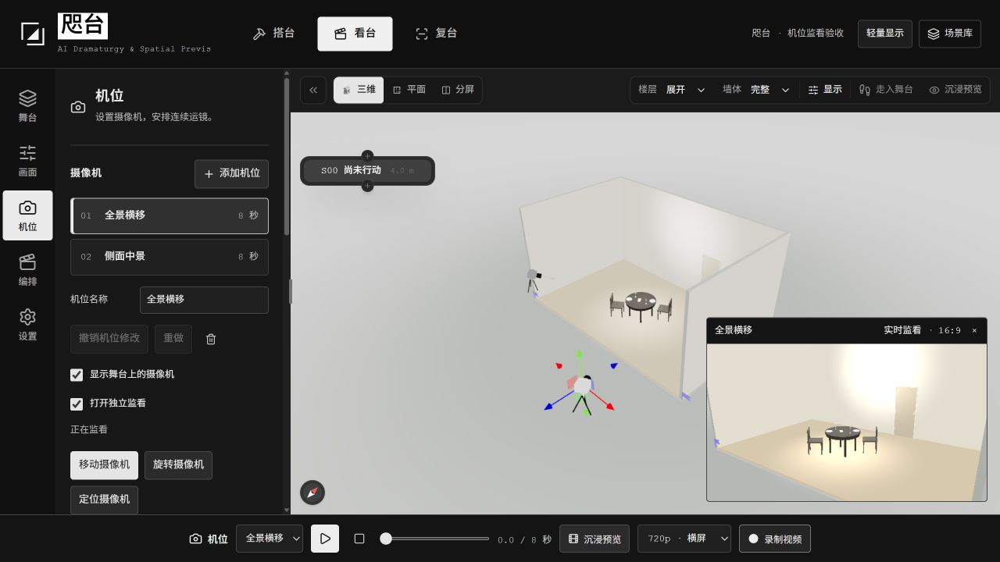

# 咫台 · 工作区与机位说明

在当前网站打开 `/scene/97986292a09d?disable=postFx`，可进入新手演示场景。

## 工作区层级

| 工作区 | 面板 | 用途 |
| --- | --- | --- |
| 搭台 | 物件库、建模、材质、舞台 | 建立空间、放置物件、调整材质与场景层级。 |
| 看台 | 舞台 | 查看和选择场景中的对象。 |
| 看台 | 画面 | 调整光影、显示与投影方式。 |
| 看台 | 机位 | 摆放摄像机，设置关键帧、目标跟随与运镜。 |
| 看台 | 编排 | 设置镜头起止、节奏，预演、记录运镜并输出。 |
| 复台 | 场地映射、舞台 | 设置原场地与目标场地之间的映射，检查物件在新场地中的位置。 |

“设置”是各工作区的通用入口。切换工作区后，仍使用同一份舞台场景。

## 五个容易混淆的概念

| 名称 | 含义 |
| --- | --- |
| 视图 | 顶部的“三维 / 平面 / 分屏”，决定编辑画面如何显示。分屏同时显示三维与平面。 |
| 投影 | “透视 / 正交”决定三维画面的成像方式。透视有近大远小，正交保持平行关系。添加机位、播放和录制使用三维透视画面。 |
| 机位 | 一台可选择、命名的摄像机，保存其位置、看向的位置和视角（FOV）。一个机位可以有多个关键帧。 |
| 运镜 | 同一机位随时间改变位置、朝向或视角，也可以看向或跟随一个对象。 |
| 编排 | 另一套镜头序列设置，控制 A/B 起止、运动方式、节奏与输出。带入机位关键帧只复制该帧，不会自动串联全部机位或整条运镜。 |

## 从添加机位到连续预演

1. **添加机位。** 打开“看台 → 机位”，切到三维透视画面，先把主画面调整到希望的视角，再点“添加机位”。新机位从当前视角建立。
2. **定位并选择关键帧。** 在机位列表中选择摄像机，再选择要编辑的关键帧。勾选“显示舞台上的摄像机”，点“定位摄像机”找到它；该按钮用于查看摄像机所在位置。“在主画面查看”则从该关键帧取景。
3. **移动或旋转。** 点“移动摄像机”或“旋转摄像机”，在三维中拖动相应操纵柄；在二维平面中拖动摄像机符号以改变 XZ 位置或水平朝向。三维和平面编辑的是同一关键帧。高度与俯仰可通过“摄像机位置”“朝向：看向的位置”数值调整。松开提交，按 Esc 取消当前拖动。
4. **查看构图。** 勾选“打开独立监看”，在三维或分屏中查看所选机位、所选关键帧的取景。监看为 **16:9、512×288** 的低分辨率构图画面，不是最终导出。主画面正在预演、取景或录制时，先点“停止并还原”，再继续摆放摄像机和监看。
5. **添加运镜关键帧。** 设置“运镜时长”，拖动底部时间线到新时间，调整主画面后点“添加关键帧”；已有同一时间的帧会显示“更新此关键帧”。也可选中某帧，通过数值或摄像机操纵柄调整它。用底部播放按钮检查连续运动。
6. **需要时开启目标跟随。** 在“目标跟随”中选择“沿路径移动，始终看向目标”或“与目标保持固定距离”，再选跟随对象。跟随开启时，摄像机拖拽被禁用；将跟随方式改回“按机位路径拍摄”即可继续拖动。可选的对象行动线只在预演中移动对象，停止后还原。
7. **带入编排。** 先在“机位”选择一个关键帧，再到“编排”点“用当前关键帧设置起点 A”；返回选择另一帧，再点“用当前关键帧设置终点 B”。选择“两点移动”等运动方式、设置序列时长后播放。跟随机位不能直接复制关键帧到 A/B：先关闭跟随，或从主画面使用“设为起点 A / 设为终点 B”。

## 撤销与备份

- 机位修改使用机位面板里的“撤销机位修改”和“重做”，与舞台模型的撤销记录分开。一次完成的摄像机拖拽对应一次机位撤销。
- 机位工程按场景分别自动保存在当前浏览器。切换设备或清除浏览器数据前，使用“导出机位工程”备份 JSON。
- 机位工程包含机位、关键帧、跟随和行动线，不包含舞台模型；“编排”的序列设置也单独保存。请将机位工程与对应场景文件分别备份，恢复时先打开对应场景，再“导入机位工程”。
- 最终画面通过录制或“编排 → 输出视频”生成；独立监看窗口只用于检查构图。

## 本地验收 · 2026-09-09

- 全量回归及文案断言补测覆盖 464 个测试文件：4291 项通过，1 项原有跳过，无未解决失败。
- TypeScript 检查通过；Biome lint 检查 1817 个文件通过，仅保留一条原有提示；编辑器构建 6/6 任务成功。
- 浏览器已验证三维与平面的移动、旋转、一次撤销、机位切换、实时监看、第一人称模式切换、A/B 关键帧复制、录像生成与回放、刷新后恢复机位。最终刷新未出现新的运行错误。
- 原场景仍为版本 19、33 个节点，图数据摘要未改变；验收在独立副本中进行。
- 监看最高约 10 帧/秒，复用舞台显示设置，不包含完整的主视口后期处理。摄像机显示对象由现有机位数据生成，不作为家具节点写入舞台。

